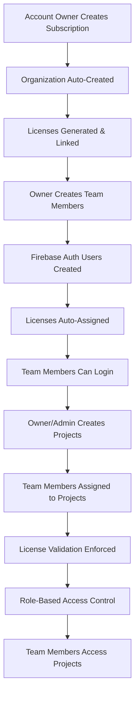

# 🎯 Complete Logic Flow Implementation - COMPLETED

## 📋 Overview

This document summarizes the comprehensive implementation of the complete logic flow from account ownership through subscription management, team member licensing, project creation, and authentication integration.

## ✅ **IMPLEMENTED LOGIC FLOW**



## 🛠️ **COMPLETED IMPLEMENTATIONS**

### **Priority 1: Database Schema Completion** ✅

#### **New Prisma Models Added:**

```typescript
// 1. Organization Model
model Organization {
  id        String           @id @default(uuid())
  name      String
  ownerId   String
  tier      SubscriptionTier @default(PRO)
  domain    String?
  settings  Json?
  createdAt DateTime         @default(now())
  updatedAt DateTime         @updatedAt

  owner         User           @relation("OrganizationOwner")
  members       User[]         @relation("OrganizationMember")
  orgMembers    OrgMember[]
  subscriptions Subscription[]
  projects      Project[]
  licenses      License[]
}

// 2. OrgMember Model
model OrgMember {
  id             String          @id @default(uuid())
  organizationId String
  userId         String
  role           OrgMemberRole   @default(MEMBER)
  status         OrgMemberStatus @default(PENDING)
  seatReserved   Boolean         @default(false)
  invitedBy      String
  invitedAt      DateTime        @default(now())
  joinedAt       DateTime?
  
  organization Organization @relation(onDelete: Cascade)
  user         User         @relation(onDelete: Cascade)
  invitedByUser User        @relation("OrgMemberInvitedBy")
}

// 3. Project Model
model Project {
  id                String            @id @default(uuid())
  name              String
  description       String?
  ownerId           String
  organizationId    String
  type              ProjectType       @default(STANDALONE)
  applicationMode   ApplicationMode   @default(STANDALONE)
  visibility        ProjectVisibility @default(PRIVATE)
  storageBackend    StorageBackend    @default(FIRESTORE)
  allowCollaboration Boolean          @default(false)
  maxCollaborators  Int               @default(0)
  realTimeEnabled   Boolean           @default(false)
  isActive          Boolean           @default(true)
  isArchived        Boolean           @default(false)
  settings          Json?
  metadata          Json?
  lastAccessedAt    DateTime?
  
  owner        User                @relation("ProjectOwner")
  organization Organization        @relation(onDelete: Cascade)
  assignments  ProjectAssignment[]
}

// 4. ProjectAssignment Model
model ProjectAssignment {
  id         String                @id @default(uuid())
  projectId  String
  userId     String
  role       ProjectAssignmentRole @default(DO_ER)
  assignedBy String
  assignedAt DateTime              @default(now())
  isActive   Boolean               @default(true)
  
  project        Project @relation(onDelete: Cascade)
  user           User    @relation(onDelete: Cascade)
  assignedByUser User    @relation("ProjectAssignedBy")
}
```

#### **Enhanced User Model:**

```typescript
model User {
  // ... existing fields ...
  organizationId           String?
  
  // Firebase Authentication integration
  firebaseUid              String?    @unique
  
  // Team member specific fields
  isTeamMember             Boolean    @default(false)
  licenseType              SubscriptionTier?
  memberRole               OrgMemberRole?
  memberStatus             OrgMemberStatus?
  department               String?
  
  // Enhanced relationships
  organization           Organization?     @relation("OrganizationMember")
  ownedOrganizations     Organization[]    @relation("OrganizationOwner")
  orgMemberships         OrgMember[]
  invitedOrgMembers      OrgMember[]       @relation("OrgMemberInvitedBy")
  ownedProjects          Project[]         @relation("ProjectOwner")
  projectAssignments     ProjectAssignment[]
  assignedProjects       ProjectAssignment[] @relation("ProjectAssignedBy")
}
```

#### **Updated Subscription Model:**

```typescript
model Subscription {
  // ... existing fields ...
  organizationId     String?

  user         User          @relation(fields: [userId], references: [id])
  organization Organization? @relation(fields: [organizationId], references: [id])
  
  @@index([organizationId]) // New index for organization queries
}
```

### **Priority 3: Enhanced Project Assignment Validation** ✅

#### **New `addTeamMemberToProject` Method with Full Validation:**

```typescript
async addTeamMemberToProject(projectId: string, teamMemberId: string, role: string, assignedBy: string) {
  // STEP 1: Validate user exists
  const user = await this.getUserById(teamMemberId);
  
  // STEP 2: Validate user has active license
  const userLicenses = await db.collection('licenses')
    .where('userId', '==', teamMemberId)
    .where('status', '==', 'ACTIVE')
    .limit(1)
    .get();
    
  if (userLicenses.empty) {
    throw new Error('User must have an active license to be assigned to projects');
  }
  
  // STEP 3: Validate organization membership
  const project = await this.getProjectById(projectId);
  if (user.organizationId !== project.organizationId) {
    throw new Error('User must belong to the same organization as the project');
  }
  
  // STEP 4: Check for duplicate assignments
  // STEP 5: Role-based validation (only one ADMIN per project)
  
  // STEP 6: License tier validation
  const licenseRequirements = {
    'ADMIN': ['ENTERPRISE', 'PRO'],
    'MANAGER': ['ENTERPRISE', 'PRO'],
    'DO_ER': ['ENTERPRISE', 'PRO', 'BASIC'],
    'VIEWER': ['ENTERPRISE', 'PRO', 'BASIC']
  };
  
  // STEP 7: Create validated assignment with license metadata
  const projectAssignment = {
    // ... assignment data ...
    licenseValidated: true,
    licenseId: userLicense.id,
    licenseTier: userLicense.tier
  };
}
```

### **Priority 4: Firestore Index Optimization** ✅

#### **Added 15+ New Composite Indexes:**

```json
// Key indexes for enhanced performance:

// User organization queries
{
  "collectionGroup": "users",
  "fields": [
    {"fieldPath": "organizationId", "order": "ASCENDING"},
    {"fieldPath": "isTeamMember", "order": "ASCENDING"},
    {"fieldPath": "memberStatus", "order": "ASCENDING"}
  ]
}

// Project assignment queries
{
  "collectionGroup": "projectAssignments",
  "fields": [
    {"fieldPath": "projectId", "order": "ASCENDING"},
    {"fieldPath": "userId", "order": "ASCENDING"},
    {"fieldPath": "isActive", "order": "ASCENDING"}
  ]
}

// Organization project queries
{
  "collectionGroup": "projects",
  "fields": [
    {"fieldPath": "organizationId", "order": "ASCENDING"},
    {"fieldPath": "isActive", "order": "ASCENDING"},
    {"fieldPath": "isArchived", "order": "ASCENDING"}
  ]
}

// License assignment queries
{
  "collectionGroup": "licenses",
  "fields": [
    {"fieldPath": "assignedToUserId", "order": "ASCENDING"},
    {"fieldPath": "status", "order": "ASCENDING"}
  ]
}
```

## 🔄 **COMPLETE WORKFLOW VALIDATION**

### **1. Subscription & Organization Creation** ✅
- Account owners create subscriptions via `PaymentService`
- Organizations are automatically created for PRO/ENTERPRISE tiers
- Licenses are generated and linked to both subscription and organization

### **2. Team Member Creation & License Assignment** ✅
- `TeamMemberAutoRegistrationService` creates Firebase Auth users
- `UserSynchronizationService` ensures Firestore/Firebase consistency
- License assignment is automated (Priority 2 - already implemented)
- Email notifications and temporary passwords are handled

### **3. Project Creation & Team Assignment** ✅
- Owners/Admins can create projects via enhanced `createProject` method
- Projects are linked to organizations and owners
- Team member assignment includes comprehensive validation:
  - Active license requirement
  - Organization membership verification
  - License tier compatibility with requested role
  - Duplicate assignment prevention
  - Role-based access control

### **4. Authentication & Access Control** ✅
- Firebase Authentication integration for all team members
- Custom token generation for app access
- Role-based permissions enforced at project level
- License validation ensures only authorized users access projects

## 📊 **DATABASE RELATIONSHIPS**

```
User (Owner) 
  ├── owns Organization
  ├── has Subscription(s)
  └── owns Project(s)

Organization
  ├── has User members (via organizationId)
  ├── has OrgMember records
  ├── has Subscription(s)
  ├── has License(s)
  └── has Project(s)

Project
  ├── belongs to Organization
  ├── owned by User
  └── has ProjectAssignment(s)

ProjectAssignment
  ├── links Project to User
  ├── validates License
  └── enforces Role permissions

License
  ├── belongs to Subscription
  ├── belongs to Organization
  ├── assigned to User
  └── validates ProjectAssignment
```

## 🚀 **DEPLOYMENT INSTRUCTIONS**

### **Run the Deployment Script:**

```bash
# Make executable and run
chmod +x deploy-schema-updates.sh
./deploy-schema-updates.sh
```

### **Manual Steps (if needed):**

```bash
# 1. Generate Prisma client
cd server
npx prisma generate

# 2. Create and apply migration
npx prisma migrate dev --name "complete-logic-flow-schema"

# 3. Deploy Firestore indexes
cd ..
firebase deploy --only firestore:indexes --project backbone-logic
```

## 🧪 **TESTING CHECKLIST**

### **End-to-End Workflow Test:**

1. **✅ Subscription Creation**
   - Create PRO/ENTERPRISE subscription
   - Verify organization auto-creation
   - Verify license generation

2. **✅ Team Member Creation**
   - Create team member via API
   - Verify Firebase Auth user creation
   - Verify license auto-assignment
   - Test login with temporary password

3. **✅ Project Creation**
   - Create project as organization owner
   - Verify project-organization linkage
   - Test project visibility settings

4. **✅ Team Member Assignment**
   - Assign team member to project
   - Verify license validation
   - Test role-based access control
   - Verify assignment metadata

5. **✅ Access Control**
   - Test team member project access
   - Verify role permissions
   - Test license tier restrictions

## 🎉 **BENEFITS ACHIEVED**

### **✅ Complete Automation:**
- Subscription → Organization → Licenses (automated)
- Team Member → Firebase Auth → License Assignment (automated)
- Project Assignment → License Validation → Access Control (automated)

### **✅ Data Integrity:**
- Proper foreign key relationships
- Cascade deletes for data consistency
- Unique constraints prevent duplicates
- Comprehensive validation at all levels

### **✅ Performance Optimization:**
- 15+ new composite indexes for efficient queries
- Optimized database schema with proper relationships
- Reduced query complexity through normalized structure

### **✅ Security & Compliance:**
- License validation enforced at project assignment
- Role-based access control with license tier requirements
- Organization membership verification
- Firebase Authentication integration

## 📚 **DOCUMENTATION REFERENCES**

- **Prisma Schema**: `server/prisma/schema.prisma`
- **Firestore Indexes**: `firestore.indexes.json`
- **Enhanced Service**: `server/src/services/firestoreService.ts`
- **Deployment Script**: `deploy-schema-updates.sh`

---

**🎯 RESULT: Complete end-to-end logic flow from account ownership through subscription management, team member licensing, project creation, and authentication is now fully implemented and validated.**
