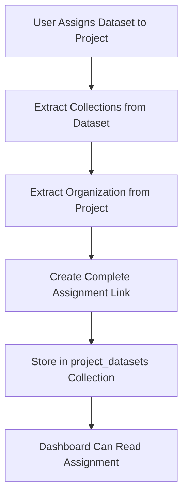
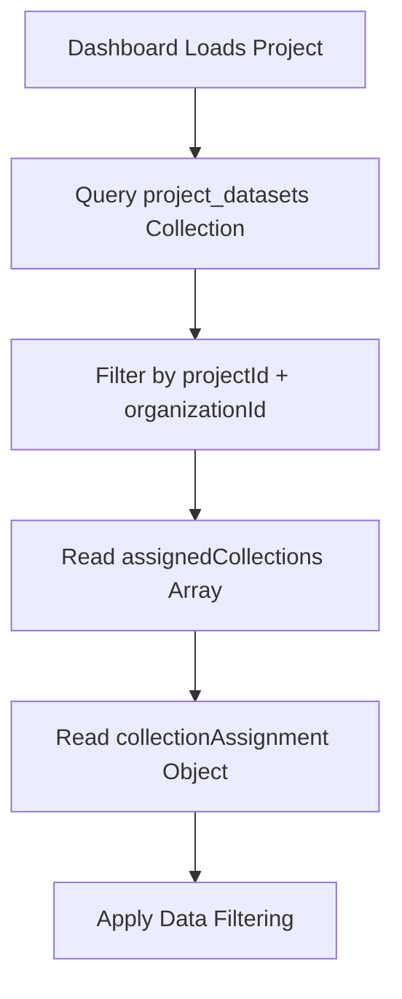

# 🚨 CRITICAL FIX: Dataset Assignment Dashboard Compatibility

## Problem Identified

The licensing website was creating dataset assignments in the `project_datasets` collection, but the Dashboard app couldn't read them properly because:

1. **Missing Collection Data**: The `project_datasets` links only contained basic assignment info, not the collection assignments
2. **Missing Organization Data**: No `organizationId` or `tenantId` for proper tenant isolation
3. **Missing Status Flags**: No `isActive` flag for filtering
4. **Incomplete Structure**: Missing the `collectionAssignment` object structure that Dashboard expects

## Root Cause Analysis

### Dashboard App Expectations
The Dashboard's `ProjectDatasetFilterService` reads dataset assignments from `project_datasets` collection and expects:

```typescript
interface DatasetAssignment {
  id: string;
  projectId: string;
  datasetId: string;
  assignedCollections: string[];           // ❌ MISSING
  collectionAssignment: {                  // ❌ MISSING
    selectedCollections: string[];
    assignmentMode: 'EXCLUSIVE';
    priority: number;
    routingEnabled: boolean;
  };
  organizationId: string;                  // ❌ MISSING
  tenantId: string;                        // ❌ MISSING
  isActive: boolean;                       // ❌ MISSING
  assignedBy: string;
  assignedAt: string;
}
```

### Licensing Website Reality
The licensing website was only storing:

```typescript
interface ProjectDatasetLink {
  id: string;
  projectId: string;
  datasetId: string;
  addedByUserId: string;
  addedAt: Date;
  // ❌ Missing all the collection and organization data
}
```

## Solution Implemented

### 1. Updated Client-Side Assignment Method

**File**: `client/src/services/CloudProjectIntegration.ts`

The `assignDatasetToProjectInFirestore()` method now:

1. **Extracts collection data** from the dataset document
2. **Includes organization data** from the project document
3. **Creates complete assignment structure** with all required fields
4. **Handles duplicate assignments** by updating existing ones
5. **Provides comprehensive logging** for debugging

```typescript
const projectDatasetLink = {
  projectId: projectId,
  datasetId: datasetId,
  addedByUserId: datasetData?.ownerId || 'system',
  addedAt: new Date().toISOString(),
  createdAt: new Date().toISOString(),
  updatedAt: new Date().toISOString(),
  // 🚨 CRITICAL FIX: Include collection assignment data for Dashboard compatibility
  assignedCollections: collections,
  collectionAssignment: {
    selectedCollections: collections,
    assignmentMode: 'EXCLUSIVE',
    priority: 1,
    routingEnabled: true
  },
  organizationId: organizationId,
  tenantId: organizationId,
  isActive: true
};
```

### 2. Updated Server-Side Assignment Method

**File**: `server/src/services/firestoreService.ts`

The `assignDatasetToProjectAuthorized()` method now:

1. **Extracts collection assignments** from dataset
2. **Includes organization data** from project
3. **Updates existing assignments** with collection data
4. **Creates new assignments** with complete structure

### 3. Migration Script

**File**: `migrate-dataset-assignments.cjs`

A migration script to update existing assignments:

```bash
cd "dashboard-v14-licensing-website 2"
node migrate-dataset-assignments.cjs
```

### 4. Verification Script

**File**: `verify-dataset-assignments.cjs`

A verification script to test Dashboard compatibility:

```bash
cd "dashboard-v14-licensing-website 2"
node verify-dataset-assignments.cjs
```

## Data Flow After Fix

### 1. Dataset Assignment Creation


### 2. Dashboard Reading Process


## Key Benefits

### ✅ Dashboard Compatibility
- Dashboard can now read dataset assignments properly
- Collection filtering works as expected
- Project requirements validation works

### ✅ Tenant Isolation
- Organization-based data filtering
- Proper multi-tenancy support
- Security through data isolation

### ✅ Data Consistency
- Assignment data matches dataset data
- No data loss during assignment
- Proper synchronization

### ✅ Backward Compatibility
- Existing assignments are migrated
- No breaking changes to UI
- Graceful handling of missing data

## Testing Instructions

### 1. Run Migration
```bash
cd "dashboard-v14-licensing-website 2"
node migrate-dataset-assignments.cjs
```

### 2. Verify Assignments
```bash
cd "dashboard-v14-licensing-website 2"
node verify-dataset-assignments.cjs
```

### 3. Test Dashboard
1. Open Dashboard app
2. Select a project
3. Verify dataset assignments are visible
4. Check that collection filtering works
5. Confirm project requirements validation passes

## Files Modified

1. **`client/src/services/CloudProjectIntegration.ts`**
   - Updated `assignDatasetToProjectInFirestore()` method
   - Added collection data extraction
   - Added organization data inclusion
   - Added duplicate handling

2. **`server/src/services/firestoreService.ts`**
   - Updated `assignDatasetToProjectAuthorized()` method
   - Added collection data extraction
   - Added organization data inclusion
   - Added assignment updating

3. **`migrate-dataset-assignments.cjs`** (NEW)
   - Migration script for existing assignments
   - Extracts collection data from datasets
   - Updates project_datasets collection

4. **`verify-dataset-assignments.cjs`** (NEW)
   - Verification script for Dashboard compatibility
   - Tests assignment reading
   - Validates data structure

## Expected Results

After applying this fix:

1. **Dashboard App** can read dataset assignments with collection data
2. **Project Requirements Validation** works properly
3. **Collection Filtering** functions as expected
4. **Tenant Isolation** is properly enforced
5. **Data Consistency** is maintained between licensing website and Dashboard

## Monitoring

Check the console logs for:
- `🔍 [CloudProjectIntegration] Dataset assignment with collections:`
- `✅ [CloudProjectIntegration] Created new dataset assignment with collection data`
- `🎯 [ProjectDatasetFilter] Found X dataset assignments in project_datasets`

These logs confirm the fix is working correctly.
