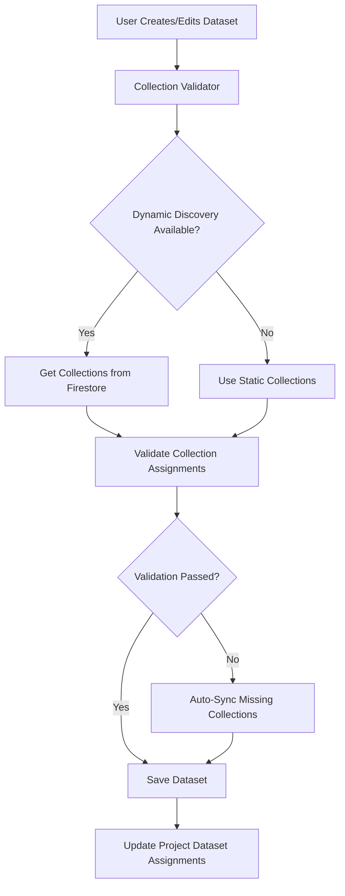

# 🔧 Dataset Collection Integrity Guide

## Overview

This guide ensures that dataset creation and editing in the licensing website properly handles collection assignments and prevents the "BLOCKING access" issues that occurred in the Dashboard application.

## 🚨 Problem Solved

**Previous Issue**: The licensing website's `ALL_DASHBOARD_COLLECTIONS` only included ~50 collections instead of the required 90 collections, causing dataset assignments to be incomplete and resulting in data access blocks in the Dashboard.

**Solution**: Comprehensive collection management system with dynamic discovery, validation, and migration capabilities.

## 🏗️ Architecture

### 1. Enhanced Collection Constants
- **File**: `client/src/constants/dashboardCollections.ts`
- **Updated**: Now includes all 90 collections across 10 categories
- **Features**: Categorized collections with proper descriptions and icons

### 2. Collection Validator Service
- **File**: `client/src/services/DatasetCollectionValidator.ts`
- **Purpose**: Validates and syncs dataset collection assignments
- **Features**:
  - Dynamic collection discovery from Firestore
  - Collection validation and recommendations
  - Automatic sync with missing collections
  - Caching for performance

### 3. Migration Script
- **File**: `client/src/scripts/migrateDatasetCollections.ts`
- **Purpose**: Migrates existing datasets to include all collections
- **Features**:
  - Batch processing of all datasets
  - Project dataset assignment updates
  - Dry-run mode for testing
  - Comprehensive validation reporting

## 🔄 Implementation Details

### Collection Assignment Flow



### Key Features

#### 1. Dynamic Collection Discovery
```typescript
// Automatically discovers collections from Firestore
const allCollections = await datasetCollectionValidator.getCollectionRecommendations('ALL_DATA');
```

#### 2. Collection Validation
```typescript
// Validates dataset collection assignments
const validation = await datasetCollectionValidator.validateDatasetCollections(datasetCollections);
if (!validation.isValid) {
    // Auto-sync missing collections
    const syncedCollections = await datasetCollectionValidator.syncDatasetCollections(datasetCollections);
}
```

#### 3. Migration Support
```typescript
// Migrate all existing datasets
const result = await datasetCollectionMigrator.migrateAllDatasets({
    dryRun: false,
    forceUpdate: true
});
```

## 📋 Collection Categories

### Core System (9 collections)
- users, teamMembers, organizations, projects, roles, projectTeamMembers, clients, contacts, test

### Sessions & Workflows (14 collections)
- sessions, sessionWorkflows, sessionAssignments, sessionParticipants, workflowTemplates, workflowDiagrams, workflowInstances, workflowSteps, workflowAssignments, sessionPhaseTransitions, sessionReviews, sessionQc, sessionTasks, demoSessions

### Inventory & Equipment (13 collections)
- inventoryItems, inventory, networkIPAssignments, networkIPRanges, networks, inventoryHistory, setupProfiles, schemas, schemaFields, mapLayouts, mapLocations, inventoryMaps, mapData, ipRanges

### Timecards & Scheduling (6 collections)
- timecard_configurations, timecard_entries, timecard_template_assignments, timecard_templates, user_timecards, timecard_approvals

### Media & Content (13 collections)
- mediaFiles, postProductionTasks, stages, notes, reports, callSheets, callSheetTemplates, dailyCallSheets, callSheetPersonnel, callSheetDepartments, callSheetRoles, callsheet_templates, dailyCallSheetRecords

### AI & Automation (5 collections)
- aiAgents, messages, chats, messageSessions, notifications

### Business & Licensing (6 collections)
- licenses, subscriptions, payments, userPreferences, auditLogs, audit_logs

### Production Budget Management (8 collections)
- pbmProjects, pbmSchedules, pbmPayscales, pbmDailyStatus, pbmBudgetCategories, pbmFinancialSummary, pbmAnalytics, pbmEpisodes

### Network Delivery & Deliverables (7 collections)
- networkDeliveryBibles, deliverables, enhancedDeliverables, networkDeliveryChats, deliverySpecs, deliveryTemplates, deliveryTracking

### Weather & Environment (3 collections)
- weatherData, weatherTemplates, weatherForecasts

### System & Administration (5 collections)
- datasetAssignments, datasets, edl_data, roleSyncEvents, schemas

**Total: 90 collections**

## 🚀 Usage Instructions

### 1. Creating New Datasets
The dataset creation wizard now automatically:
- Discovers all available collections dynamically
- Validates collection assignments
- Provides "Select All" functionality with complete collection list
- Ensures compatibility with Dashboard requirements

### 2. Editing Existing Datasets
The edit dialog now:
- Uses dynamic collection discovery
- Validates current assignments
- Provides recommendations for missing collections
- Auto-syncs collections when needed

### 3. Migrating Existing Datasets
Run the migration script to update existing datasets:

```typescript
import { datasetCollectionMigrator } from '../scripts/migrateDatasetCollections';

// Dry run first
const dryRunResult = await datasetCollectionMigrator.migrateAllDatasets({ dryRun: true });
console.log('Dry run results:', dryRunResult);

// Actual migration
const result = await datasetCollectionMigrator.migrateAllDatasets({ 
    dryRun: false,
    forceUpdate: true 
});
console.log('Migration completed:', result);
```

### 4. Validation
Validate all datasets:

```typescript
const validation = await datasetCollectionMigrator.validateAllDatasets();
console.log(`Valid datasets: ${validation.validDatasets}/${validation.totalDatasets}`);
```

## 🔍 Monitoring & Maintenance

### 1. Collection Cache
- Collections are cached for 5 minutes
- Use `datasetCollectionValidator.refreshCollectionCache()` to force refresh
- Dynamic discovery falls back to static collections if needed

### 2. Validation Reports
- Regular validation can be run to ensure dataset integrity
- Reports show missing collections and recommendations
- Automated alerts can be set up for validation failures

### 3. Performance Considerations
- Collection discovery is cached to avoid repeated Firestore queries
- Batch processing for migration operations
- Lazy loading of validation services

## 🛡️ Error Prevention

### 1. Automatic Validation
- All dataset operations now include validation
- Missing collections are automatically added
- Invalid collections are flagged for review

### 2. Fallback Mechanisms
- Static collections as fallback when dynamic discovery fails
- Graceful error handling with user-friendly messages
- Comprehensive logging for debugging

### 3. Data Integrity
- Project dataset assignments are automatically updated
- Collection counts are validated
- Organization scoping is maintained

## 📊 Benefits

### 1. Complete Data Access
- All 90 collections are available for assignment
- No more "BLOCKING access" errors in Dashboard
- Full compatibility with Dashboard requirements

### 2. Dynamic Discovery
- Collections are discovered from actual Firestore schema
- Automatic updates when new collections are added
- Future-proof against schema changes

### 3. User Experience
- "Select All" now includes all collections
- Clear validation messages and recommendations
- Intuitive collection management interface

### 4. Maintenance
- Automated migration scripts
- Comprehensive validation tools
- Easy monitoring and reporting

## 🔧 Troubleshooting

### Common Issues

1. **Dynamic Discovery Fails**
   - Falls back to static collections
   - Check Firestore permissions
   - Verify network connectivity

2. **Migration Errors**
   - Run in dry-run mode first
   - Check dataset permissions
   - Review error logs for specific issues

3. **Validation Failures**
   - Check collection names against Firestore schema
   - Verify organization scoping
   - Review collection assignment structure

### Debug Commands

```typescript
// Check collection cache
const collections = await datasetCollectionValidator.getAllAvailableCollections();
console.log('Available collections:', collections.length);

// Validate specific dataset
const validation = await datasetCollectionValidator.validateDatasetCollections(datasetCollections);
console.log('Validation result:', validation);

// Force cache refresh
await datasetCollectionValidator.refreshCollectionCache();
```

## 📈 Future Enhancements

1. **Real-time Collection Monitoring**
   - WebSocket-based collection updates
   - Automatic dataset synchronization
   - Live validation feedback

2. **Advanced Collection Management**
   - Collection dependency mapping
   - Smart collection recommendations
   - Collection usage analytics

3. **Enhanced Migration Tools**
   - Incremental migration support
   - Rollback capabilities
   - Migration progress tracking

This comprehensive solution ensures that dataset collection assignments are always complete and up-to-date, preventing the data access issues that occurred previously.
