# 🚨 CRITICAL ISSUE: Dataset Collection Assignment Data Routing Missing

## Problem Identified

The current Dataset Collection Assignment system has a **fundamental gap**:

### ✅ What Works (UI Only)
- Dataset creation with collection assignments
- Collection assignment storage in dataset metadata
- Conflict detection and warnings
- Edit dataset functionality
- Beautiful categorized UI

### ❌ What's Missing (Critical Data Flow)
- **No data routing mechanism** that actually directs data to assigned collections
- Data still flows to standard collections regardless of dataset assignments
- No enforcement of dataset-based collection isolation
- No actual multi-tenancy at the data level

## Current Data Flow (Broken)


## Required Data Flow (Fixed)

```mermaid
graph TD
    A[User Creates Dataset] --> B[Assigns Collections to Dataset]
    B --> C[Dataset Metadata Stored]
    
    D[User Creates Session Data] --> E[Check Project's Dataset Assignments]
    E --> F[Route Data to Assigned Collections]
    F --> G[✅ Data Isolated by Dataset]
    
    H[Dataset Removed from Project] --> I[Data Access Revoked]
    I --> J[✅ True Modular System]
    
    style G fill:#51cf66
    style J fill:#51cf66
```



## Impact Assessment

### 🔴 Critical Issues
1. **False Security**: Users think data is isolated, but it's not
2. **No True Multi-Tenancy**: All organizations share the same collections
3. **Dataset Removal Ineffective**: Removing datasets doesn't affect data access
4. **Misleading UI**: System appears to work but doesn't enforce assignments

### 📊 Current State
- **UI Implementation**: 100% Complete ✅
- **Data Routing**: 0% Complete ❌
- **Multi-Tenancy**: 0% Complete ❌
- **Access Control**: 0% Complete ❌

## Required Implementation

### 1. Data Router Service
Create a service that intercepts all data writes and routes them based on dataset assignments:

```typescript
class DatasetDataRouter {
  async routeDataWrite(
    projectId: string, 
    collectionName: string, 
    data: any
  ): Promise<string> {
    // 1. Get project's dataset assignments
    // 2. Find which dataset handles this collection
    // 3. Route data to dataset-specific collection
    // 4. Return actual collection path used
  }
}
```

### 2. Collection Naming Strategy
Implement dataset-scoped collections:

```
Standard: sessions
Dataset-scoped: sessions_dataset_[datasetId]

Standard: teamMembers  
Dataset-scoped: teamMembers_dataset_[datasetId]
```

### 3. Access Control Layer
Implement dataset-based access control:

```typescript
class DatasetAccessControl {
  async canAccessData(
    userId: string, 
    projectId: string, 
    collectionName: string
  ): Promise<boolean> {
    // Check if user's project has dataset assigned for this collection
  }
}
```

### 4. Migration Strategy
- Migrate existing data to dataset-scoped collections
- Update all API endpoints to use data router
- Implement backward compatibility

## Test Scenarios That Currently Fail

### Scenario 1: Data Isolation
1. Create Dataset A with 'sessions' collection
2. Create Dataset B with 'teamMembers' collection  
3. Create session data
4. **Expected**: Data goes to Dataset A's sessions collection
5. **Actual**: Data goes to standard 'sessions' collection ❌

### Scenario 2: Dataset Removal
1. Assign Dataset A to Project X
2. Create session data in Project X
3. Remove Dataset A from Project X
4. **Expected**: Project X loses access to session data
5. **Actual**: Project X still has full access ❌

### Scenario 3: Multi-Tenant Isolation
1. Org A creates Dataset with 'users' collection
2. Org B creates Dataset with 'users' collection
3. **Expected**: Each org's data is isolated
4. **Actual**: Both orgs share the same 'users' collection ❌

## Recommended Action Plan

### Phase 1: Core Data Router (Critical)
- [ ] Create DatasetDataRouter service
- [ ] Implement collection routing logic
- [ ] Update Firebase Functions to use router

### Phase 2: Access Control (Critical)  
- [ ] Implement dataset-based access control
- [ ] Update Firestore security rules
- [ ] Add permission checks to all endpoints

### Phase 3: Migration (Important)
- [ ] Create data migration scripts
- [ ] Migrate existing data to dataset-scoped collections
- [ ] Update all API endpoints

### Phase 4: Testing (Critical)
- [ ] Create comprehensive end-to-end tests
- [ ] Validate true data isolation
- [ ] Test dataset removal scenarios

## Conclusion

The current system is **cosmetic only** - it provides a beautiful UI for dataset management but doesn't actually implement the core functionality of data routing and isolation. This is a critical security and functionality gap that must be addressed before the system can be considered production-ready for multi-tenant environments.

**Priority**: 🚨 **CRITICAL** - System appears to work but provides no actual data isolation or security.
