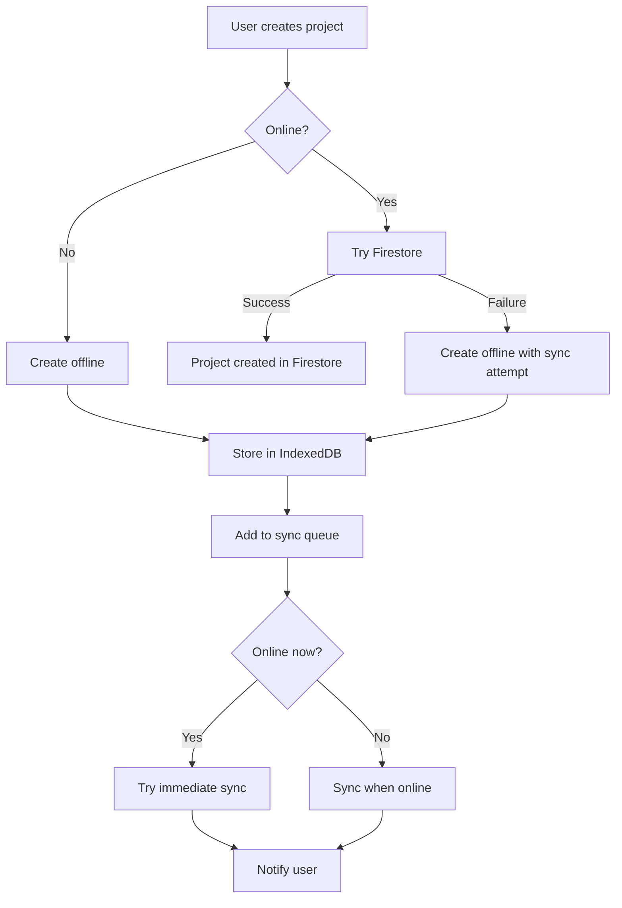

# Hybrid Offline Project Creation

## Overview

This feature enables project creation in the licensing website even when offline or when Firebase authentication fails. The licensing website is configured to always run in web-only mode, but now includes a hybrid approach that allows:

1. **Online Operation**: Direct Firestore access when online (standard web-only mode)
2. **Offline Operation**: Local storage with automatic synchronization when online
3. **Fallback Operation**: Local creation with immediate sync attempt when Firebase Auth fails

## How It Works

### Architecture

The implementation consists of three main components:

1. **NetworkUtils**: Utilities for detecting network connectivity and managing online/offline events
2. **OfflineStorageManager**: IndexedDB-based storage for offline projects and sync queue
3. **SyncService**: Background service that synchronizes offline data with Firestore when online

### Project Creation Flow



### Offline Storage

Projects created while offline are stored in IndexedDB with:
- Unique offline ID (`offline_[uuid]`)
- Complete project metadata
- Original creation options for later sync

### Synchronization

The sync process:
1. Runs automatically when network connection is restored
2. Runs periodically (every 5 minutes) when online
3. Can be triggered manually through the UI
4. Handles both project creation and updates

## User Experience

### Online Mode
- Projects are created directly in Firestore
- Normal web-only mode behavior
- Full collaboration features

### Offline Mode
- Projects are created locally
- Offline indicator shown in UI
- Automatic sync when online
- Basic collaboration features available

### Edge Cases
- **Firebase Auth Failure**: Falls back to offline creation with immediate sync attempt
- **Sync Conflicts**: Newer version wins, with conflict resolution
- **Multiple Devices**: Each device maintains its own offline queue

## Testing

A test page is available at `/test/offline` to test offline project creation:

1. Go to the test page
2. Disconnect from the internet (or use browser dev tools to simulate offline)
3. Create a test project
4. Observe that the project is created locally
5. Reconnect to the internet
6. Click "Force Sync" or wait for automatic sync
7. Verify that the project is synchronized to Firestore

You can also use the browser console to run tests:

```javascript
// Run all offline tests
window.runOfflineTests();

// Test offline project creation
window.testOfflineProjectCreation();

// Test offline project listing
window.testOfflineProjectListing();
```

## Implementation Details

### Key Files

- `src/utils/NetworkUtils.ts`: Network connectivity detection
- `src/services/OfflineStorageManager.ts`: IndexedDB storage for offline data
- `src/services/SyncService.ts`: Synchronization with Firestore
- `src/services/CloudProjectIntegration.ts`: Modified to support offline creation
- `src/test/offline-project-creation-test.ts`: Test utilities
- `src/pages/test/OfflineTestPage.tsx`: Test UI

### Offline Project Structure

```typescript
interface OfflineProject {
  id: string;              // Temporary ID (offline_[uuid])
  name: string;            // Project name
  description?: string;    // Project description
  createdAt: string;       // Creation timestamp
  updatedAt: string;       // Last update timestamp
  storageMode: string;     // Storage mode (local, cloud, hybrid)
  applicationMode: string; // Application mode (standalone, shared_network)
  pendingSync: boolean;    // Whether sync is pending
  syncAttempts: number;    // Number of sync attempts
  originalOptions: any;    // Original creation options
}
```

### Sync Queue Item Structure

```typescript
interface SyncQueueItem {
  id: string;                                      // Queue item ID
  type: 'project_create' | 'project_update' | 'project_delete'; // Operation type
  data: any;                                       // Operation data
  createdAt: string;                               // Creation timestamp
  attempts: number;                                // Number of sync attempts
  lastAttempt?: string;                            // Last attempt timestamp
}
```

## Benefits

1. **Improved Reliability**: Projects can be created even when offline or when Firebase Auth fails
2. **Better User Experience**: No interruptions in workflow due to connectivity issues
3. **Data Persistence**: Projects are never lost due to network issues
4. **Automatic Recovery**: Seamless synchronization when connectivity is restored

## Limitations

1. **Collaboration**: Limited collaboration features when offline
2. **Storage**: Local storage limits apply to offline projects
3. **Complex Operations**: Some advanced features may not be available offline

## Future Enhancements

1. **Conflict Resolution**: More sophisticated conflict resolution for sync conflicts
2. **Offline Editing**: Support for editing offline projects
3. **Team Collaboration**: Enhanced offline collaboration features
4. **Sync Progress**: Better visibility of sync progress and status
