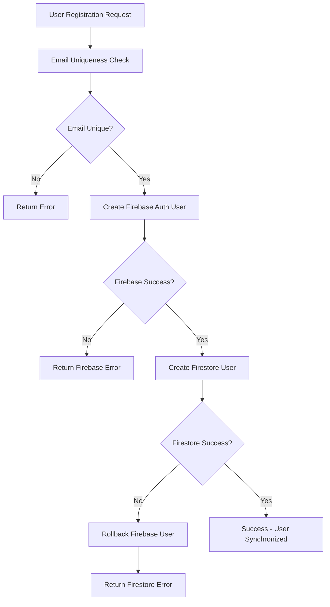

# 🔐 User Synchronization System

## 🎯 **Overview**

This document describes the comprehensive user synchronization system that ensures proper coordination between Firebase Authentication and Firestore users collection, with strict email uniqueness enforcement across both systems.

## 🚨 **Critical Problem Solved**

### **Before: Inconsistent User Management**
```
❌ Users could exist in Firestore but not Firebase Auth
❌ Users could exist in Firebase Auth but not Firestore  
❌ Duplicate emails possible across systems
❌ Manual synchronization required
❌ Authentication failures due to missing records
```

### **After: Synchronized User Management**
```
✅ All users exist in BOTH Firebase Auth AND Firestore
✅ Strict email uniqueness across both systems
✅ Automatic synchronization on creation
✅ Rollback protection if either creation fails
✅ Migration tools for existing users
```

## 🏗️ **Architecture**

### **Core Components**

1. **UserSynchronizationService** - Central service for all user operations
2. **Email Uniqueness Validation** - Prevents duplicate emails across systems
3. **Automatic Rollback** - Ensures data consistency if operations fail
4. **Migration Tools** - Synchronizes existing users
5. **Validation APIs** - Admin tools for system health monitoring

### **Data Flow**



## 🔧 **Implementation Details**

### **1. UserSynchronizationService**

**File**: `server/src/services/UserSynchronizationService.ts`

#### **Key Methods**

```typescript
// Create new synchronized user
static async createSynchronizedUser(request: CreateUserRequest): Promise<UserSyncResult>

// Validate email uniqueness across both systems
static async validateEmailUniqueness(email: string): Promise<{isUnique: boolean, existsIn: string[]}>

// Synchronize existing Firestore user with Firebase Auth
static async synchronizeExistingUser(firestoreUserId: string, password?: string): Promise<UserSyncResult>

// Get user status across both systems
static async getUserByEmail(email: string): Promise<{firestoreUser?, firebaseUser?, synchronized: boolean}>
```

#### **Email Uniqueness Validation**

```typescript
const validation = await UserSynchronizationService.validateEmailUniqueness('user@example.com');
// Returns: { isUnique: true/false, existsIn: ['Firebase Authentication', 'Firestore users collection'] }
```

### **2. Updated Registration Endpoints**

#### **Standard User Registration**
**Endpoint**: `POST /api/auth/register`

```typescript
// Before (Firestore only)
const user = await firestoreService.createUser(userData);

// After (Synchronized)
const syncResult = await UserSynchronizationService.createSynchronizedUser({
  email, password, name, role: 'USER'
});
```

#### **Team Member Registration**
**File**: `server/src/services/teamMemberAutoRegistration.ts`

```typescript
// Before (Manual Firebase + Firestore)
const firebaseUser = await getAuth().createUser(...);
const firestoreUser = await firestoreService.createUser(...);

// After (Synchronized)
const syncResult = await UserSynchronizationService.createSynchronizedUser({
  email, password, name, role: 'TEAM_MEMBER', isTeamMember: true, ...
});
```

### **3. Migration System**

#### **Migration Script**
**File**: `scripts/migrate-users-to-firebase-auth.js`

```bash
# Dry run to see what would be migrated
node migrate-users-to-firebase-auth.js --dry-run

# Validate email uniqueness before migration
node migrate-users-to-firebase-auth.js --validate-emails

# Run actual migration with custom batch size
node migrate-users-to-firebase-auth.js --batch-size=25

# Full migration
node migrate-users-to-firebase-auth.js
```

#### **Migration Process**

1. **Validation Phase**
   - Check for duplicate emails in Firestore
   - Identify users already synchronized
   - Report orphaned records

2. **Synchronization Phase**
   - Create Firebase Auth users for Firestore-only users
   - Link existing Firebase users to Firestore records
   - Update Firestore records with Firebase UIDs

3. **Verification Phase**
   - Confirm all users are synchronized
   - Report any remaining issues
   - Provide cleanup recommendations

### **4. Validation APIs**

#### **Email Uniqueness Check**
```http
GET /api/validation/email-uniqueness?email=user@example.com
```

**Response**:
```json
{
  "success": true,
  "data": {
    "email": "user@example.com",
    "isUnique": false,
    "existsIn": ["Firebase Authentication"],
    "canRegister": false
  }
}
```

#### **User Synchronization Status**
```http
GET /api/validation/user-sync-status?email=user@example.com
```

**Response**:
```json
{
  "success": true,
  "data": {
    "email": "user@example.com",
    "hasFirestoreUser": true,
    "hasFirebaseUser": true,
    "synchronized": true,
    "firestoreUserId": "abc123",
    "firebaseUid": "firebase-uid-456",
    "syncRequired": false
  }
}
```

#### **System Health Check** (Admin Only)
```http
GET /api/validation/system-email-check
```

**Response**:
```json
{
  "success": true,
  "data": {
    "summary": {
      "totalFirestoreUsers": 150,
      "totalFirebaseUsers": 148,
      "duplicateEmails": 0,
      "orphanedFirebaseUsers": 2,
      "unsyncedFirestoreUsers": 5,
      "systemHealthy": false
    },
    "issues": {
      "duplicateEmails": [],
      "orphanedFirebaseUsers": [...],
      "unsyncedFirestoreUsers": [...]
    }
  }
}
```

#### **Manual User Synchronization** (Admin Only)
```http
POST /api/validation/sync-user/USER_ID
Content-Type: application/json

{
  "password": "temporary-password-123"  // Optional
}
```

## 🛡️ **Security Features**

### **1. Email Uniqueness Enforcement**

- **Cross-System Validation**: Checks both Firebase Auth and Firestore before allowing registration
- **Race Condition Protection**: Uses Firebase Auth's built-in email uniqueness as primary constraint
- **Duplicate Prevention**: Prevents multiple accounts with same email across systems

### **2. Rollback Protection**

```typescript
// If Firestore creation fails, Firebase user is automatically deleted
try {
  const firebaseUser = await createFirebaseUser(userData);
  const firestoreUser = await createFirestoreUser(userData);
} catch (firestoreError) {
  await deleteFirebaseUser(firebaseUser.uid); // Automatic rollback
  throw new Error('User creation failed - changes rolled back');
}
```

### **3. Password Security**

- **Secure Generation**: Auto-generated passwords use cryptographically secure random generation
- **Hashing**: All passwords stored in Firestore are properly hashed using bcrypt
- **Temporary Passwords**: Team members receive secure temporary passwords for initial login

## 📊 **Monitoring & Maintenance**

### **1. Health Monitoring**

```typescript
// Regular system health checks
const healthCheck = await UserSynchronizationService.validateEmailUniqueness();
const systemStatus = await fetch('/api/validation/system-email-check');
```

### **2. Cleanup Operations**

```typescript
// Identify and clean orphaned records
const cleanup = await UserSynchronizationService.cleanupOrphanedRecords();
```

### **3. Audit Logging**

All synchronization operations are logged with:
- User email and IDs
- Operation type (create, sync, migrate)
- Success/failure status
- Error details if applicable
- Admin user performing the action

## 🚀 **Usage Examples**

### **1. Standard User Registration**

```typescript
import { UserSynchronizationService } from './services/UserSynchronizationService';

const result = await UserSynchronizationService.createSynchronizedUser({
  email: 'user@example.com',
  password: 'secure-password',
  name: 'John Doe',
  role: 'USER'
});

if (result.success) {
  console.log('User created:', result.user.id);
  console.log('Firebase UID:', result.firebaseUid);
} else {
  console.error('Creation failed:', result.error);
}
```

### **2. Team Member Creation**

```typescript
const result = await UserSynchronizationService.createSynchronizedUser({
  email: 'team@example.com',
  password: 'temp-password-123',
  name: 'Jane Smith',
  role: 'TEAM_MEMBER',
  organizationId: 'org-123',
  isTeamMember: true,
  memberRole: 'MEMBER',
  licenseType: 'PROFESSIONAL'
});
```

### **3. Email Validation Before Registration**

```typescript
const validation = await UserSynchronizationService.validateEmailUniqueness('new@example.com');

if (validation.isUnique) {
  // Proceed with registration
  const result = await UserSynchronizationService.createSynchronizedUser(...);
} else {
  console.error(`Email exists in: ${validation.existsIn.join(', ')}`);
}
```

### **4. Migrating Existing Users**

```typescript
// Migrate a specific user
const result = await UserSynchronizationService.synchronizeExistingUser('firestore-user-id');

// Or use the migration script for bulk operations
// node migrate-users-to-firebase-auth.js --batch-size=50
```

## 🔗 **Integration Points**

### **1. Registration Forms**

- Add real-time email validation
- Show clear error messages for duplicate emails
- Indicate which system already has the email

### **2. Admin Dashboards**

- Display user synchronization status
- Provide manual sync buttons for problematic users
- Show system health metrics

### **3. Authentication Flows**

- Ensure all login methods work with synchronized users
- Handle edge cases where sync might be incomplete
- Provide fallback authentication methods

## 📋 **Deployment Checklist**

### **Pre-Deployment**

- [ ] **Validate existing data** using `--validate-emails` flag
- [ ] **Run migration in dry-run mode** to identify issues
- [ ] **Backup Firestore data** before migration
- [ ] **Test with small batch** of users first

### **Deployment**

- [ ] **Deploy UserSynchronizationService** and updated endpoints
- [ ] **Run migration script** with appropriate batch size
- [ ] **Verify system health** using validation APIs
- [ ] **Monitor logs** for any synchronization errors

### **Post-Deployment**

- [ ] **Confirm all users can authenticate** successfully
- [ ] **Run system health check** to verify no orphaned records
- [ ] **Set up monitoring** for ongoing synchronization health
- [ ] **Document any manual cleanup** required

## 🆘 **Troubleshooting**

### **Common Issues**

#### **1. Duplicate Email Error**
```
Error: Email already exists in Firebase Authentication
```
**Solution**: Use the sync endpoint to link existing Firebase user to Firestore record

#### **2. Orphaned Firebase User**
```
Firebase user exists but no Firestore record found
```
**Solution**: Create Firestore record with Firebase UID reference

#### **3. Unsynced Firestore User**
```
Firestore user exists but no Firebase UID
```
**Solution**: Use migration script or manual sync endpoint

#### **4. Migration Failures**
```
Some users failed to migrate
```
**Solution**: Check logs, resolve individual issues, re-run migration for failed users

### **Recovery Procedures**

#### **Rollback Failed User Creation**
```typescript
// If user creation partially succeeded, clean up manually
await admin.auth().deleteUser(firebaseUid);
await firestoreService.deleteUser(firestoreUserId);
```

#### **Fix Synchronization Issues**
```typescript
// Re-sync specific user
const result = await UserSynchronizationService.synchronizeExistingUser(userId);
```

## 📚 **Related Documentation**

- [Firebase Authentication Documentation](https://firebase.google.com/docs/auth)
- [Firestore Security Rules](./FIRESTORE_SECURITY_RULES.md)
- [Team Member Management](./TEAM_MEMBER_MANAGEMENT.md)
- [MPC Library Authentication Patterns](./mpc-library/authentication/)

---

## 🎉 **Benefits Achieved**

✅ **Email Uniqueness**: No duplicate emails possible across systems  
✅ **Data Consistency**: All users exist in both Firebase Auth and Firestore  
✅ **Automatic Rollback**: Failed operations don't leave partial records  
✅ **Migration Tools**: Easy synchronization of existing users  
✅ **Admin Monitoring**: Comprehensive tools for system health  
✅ **Security**: Proper password handling and validation  
✅ **Scalability**: Batch processing for large user bases  
✅ **Reliability**: Comprehensive error handling and logging
